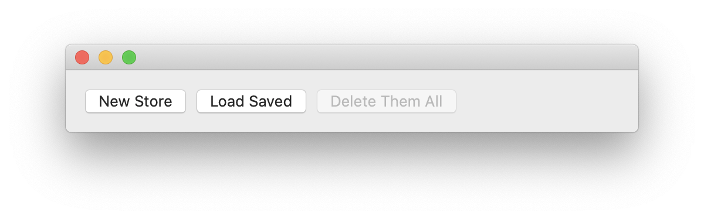
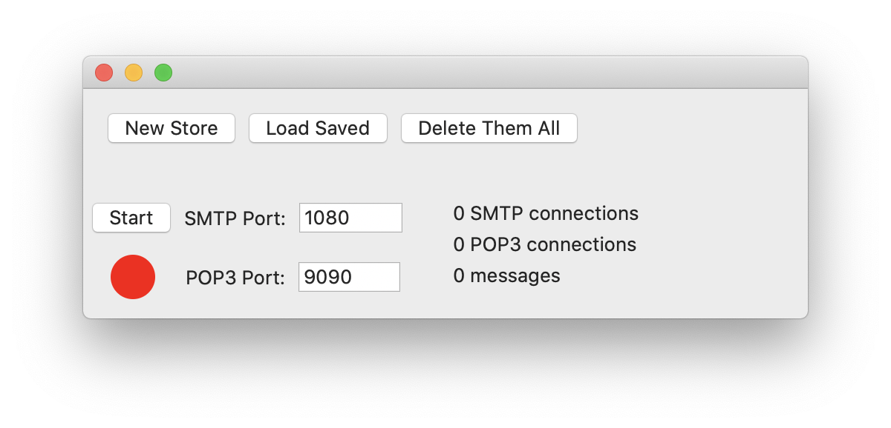

# Stumpy

An SMTP and POP3 server for local testing of email services.

## Installation

You may build the application from source, or download a pre-built version from the App Store.

## Operation

When first launched, the application displays a window with buttons to create a new mail store, load saved mail store definitions, and delete the current mail stores.

Creating a new store adds a server block to this window: 
While the servers are stopped, you may change the ports on which the SMTP and POP3 servers will listen. Obviously, these can't be changed while the servers are running.

## License and Attribution

Stumpy is distributed under the terms of the [MIT License](LICENSE). It is written in Swift, based on the architecture of [dumbster](https://github.com/rjo1970/dumbster).
